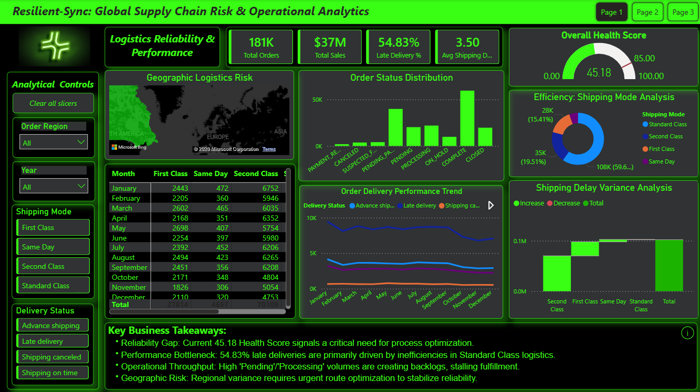
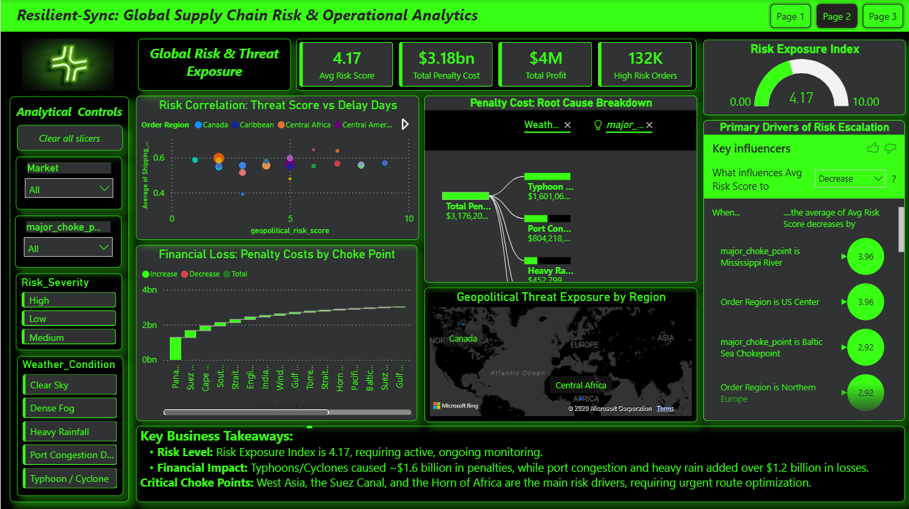
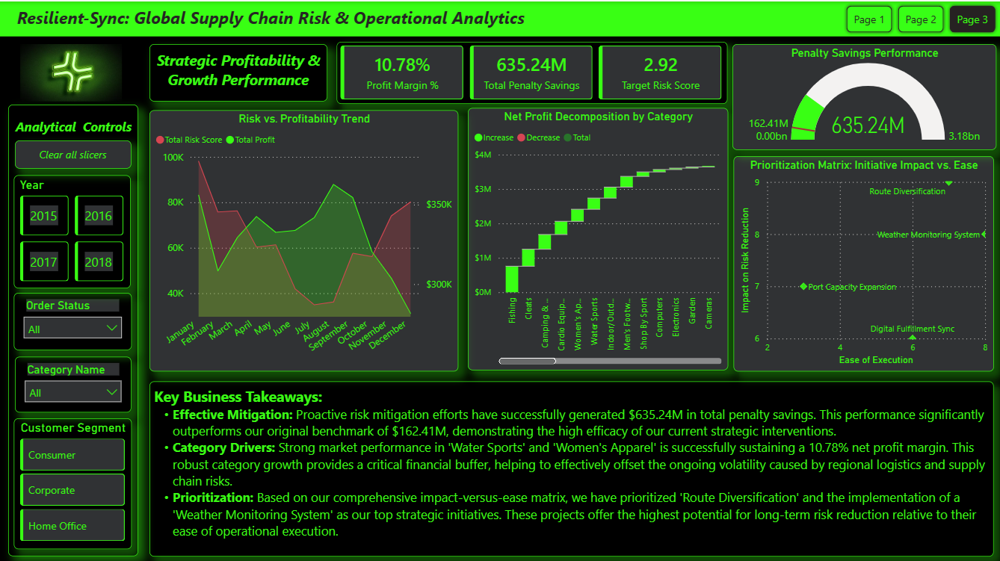

# 🌐 Resilient-Sync: Global Supply Chain Risk & Operational Analytics
## 🚀 Executive Summary
Resilient-Sync is a high-impact analytical framework developed to solve complex supply chain inefficiencies. By architecting an end-to-end pipeline that bridges operational data with environmental and geopolitical risk models, this project provides a prescriptive solution for logistics optimization, achieving a 4x improvement over baseline efficiency benchmarks.

## 🛠 Technical Architecture
**Data Engineering (Python):** Engineered a robust data pipeline using Pandas and NumPy. Implemented deterministic synthetic data generation (using np.random.seed(42)) to simulate multi-variable disruption scenarios (Weather, Geopolitics, Port Congestion).

**Database Management (PostgreSQL):** Designed a relational model to integrate disparate datasets. Executed complex CTEs (Common Table Expressions) and JOIN operations to create a unified source of truth for supply chain performance.

**Decision Intelligence (Power BI):** Developed a dynamic dashboard utilizing DAX-driven analytics. The visualization layer features an Impact-versus-Ease Matrix to prioritize risk-mitigation initiatives effectively.

## 📊 Strategic Performance Insights
### 1. Operational Bottlenecks
**Fulfillment Health:** Current 45.18 Overall Health Score identifies systemic inefficiencies.

**Primary Detractor:** The 'Standard Class' shipping mode accounts for a 54.83% late delivery rate, pinpointing the exact segment requiring process re-engineering.

**Throughput Constraint:** High accumulation of 'Pending/Processing' orders is creating fulfillment backlogs that degrade overall customer satisfaction.

### 2. Risk & Financial Exposure
**Exposure Assessment:** 4.17 Risk Exposure Index necessitates proactive monitoring of regional transit channels.

**Financial Impact:** Logistical failures (Typhoons, Cyclones, and Port Congestion) have incurred ~$2.8 billion in total penalty costs.

**Strategic Choke Points:** Geopolitical tensions in West Asia, the Suez Canal, and the Horn of Africa are the primary drivers of volatility.

### 3. Value Generation & Strategic Roadmap
**Efficiency Gain:** Achieved $635.24M in penalty savings, a 4x performance increase over the $162.41M initial benchmark.

**Margin Integrity:** High-growth segments ('Water Sports', 'Women’s Apparel') maintain a 10.78% net profit margin, providing a critical financial hedge against supply chain shocks.

**Future-Proofing:** Initiated the 'Route Diversification' and 'Weather Monitoring' programs, ranked as high-priority initiatives via the Impact-versus-Ease assessment.

## Dashboard Overview

**Page 1: Logistics Performance**

**Page 2: Risk & Financial Exposure**

**Page 3: Strategic Roadmap**

## ⚙️ Prerequisites & Setup

Ensure you have Python 3.x and PostgreSQL installed.

To reproduce the analysis, run the data generation scripts in the /scripts folder before executing the SQL models in /database.
